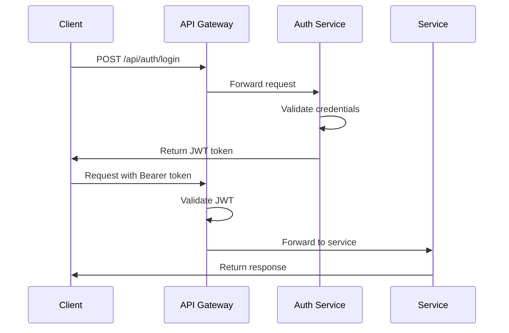

# API Reference

Complete REST API reference for FinovaBank services.

## Table of Contents

- [Base URLs](#base-urls)
- [Authentication](#authentication)
- [Auth Service API](#auth-service-api)
- [Account Management API](#account-management-api)
- [Transaction Service API](#transaction-service-api)
- [Loan Management API](#loan-management-api)
- [AI Service API](#ai-service-api)
- [Notification Service API](#notification-service-api)
- [Error Handling](#error-handling)

## Base URLs

| Environment       | Base URL                     |
| ----------------- | ---------------------------- |
| Local Development | `http://localhost:8002`      |
| Docker Compose    | `http://api-gateway:8002`    |
| Production        | `https://api.finovabank.com` |

All requests go through the API Gateway at port 8002, which routes to backend microservices.

## Authentication

FinovaBank uses JWT (JSON Web Tokens) for authentication.

### Authentication Flow



### Required Headers

| Header        | Value            | Description              |
| ------------- | ---------------- | ------------------------ |
| Content-Type  | application/json | For request body         |
| Authorization | Bearer {token}   | JWT token from login     |
| Accept        | application/json | Expected response format |

## Auth Service API

Base path: `/api/auth`

### Register User

Creates a new user account.

**Endpoint:** `POST /api/auth/register`

**Request Body:**

| Name        | Type   | Required | Default | Description                  | Example            |
| ----------- | ------ | -------- | ------- | ---------------------------- | ------------------ |
| username    | string | Yes      | -       | Unique username (3-50 chars) | "johndoe"          |
| email       | string | Yes      | -       | Valid email address          | "john@example.com" |
| password    | string | Yes      | -       | Password (min 8 chars)       | "SecurePass123!"   |
| firstName   | string | Yes      | -       | First name                   | "John"             |
| lastName    | string | Yes      | -       | Last name                    | "Doe"              |
| phone       | string | No       | null    | Phone number                 | "+1234567890"      |
| dateOfBirth | string | No       | null    | Birth date (ISO 8601)        | "1990-01-15"       |

**Example Request:**

```bash
curl -X POST http://localhost:8002/api/auth/register \
  -H "Content-Type: application/json" \
  -d '{
    "username": "johndoe",
    "email": "john@example.com",
    "password": "SecurePass123!",
    "firstName": "John",
    "lastName": "Doe"
  }'
```

**Response (201 Created):**

```json
{
  "id": "550e8400-e29b-41d4-a716-446655440000",
  "username": "johndoe",
  "email": "john@example.com",
  "firstName": "John",
  "lastName": "Doe",
  "createdAt": "2025-12-30T12:00:00Z",
  "message": "User registered successfully"
}
```

### Login

Authenticates a user and returns JWT tokens.

**Endpoint:** `POST /api/auth/login`

**Request Body:**

| Name     | Type   | Required | Default | Description       | Example          |
| -------- | ------ | -------- | ------- | ----------------- | ---------------- |
| username | string | Yes      | -       | Username or email | "johndoe"        |
| password | string | Yes      | -       | User password     | "SecurePass123!" |

**Example Request:**

```bash
curl -X POST http://localhost:8002/api/auth/login \
  -H "Content-Type: application/json" \
  -d '{
    "username": "johndoe",
    "password": "SecurePass123!"
  }'
```

**Response (200 OK):**

```json
{
  "accessToken": "eyJhbGciOiJIUzI1NiIsInR5cCI6IkpXVCJ9.eyJzdWIiOiI1NTBlODQwMC1lMjliLTQxZDQtYTcxNi00NDY2NTU0NDAwMDAiLCJ1c2VybmFtZSI6ImpvaG5kb2UiLCJpYXQiOjE2NDAzNDAwMDAsImV4cCI6MTY0MDM0MzYwMH0.xyz",
  "refreshToken": "eyJhbGciOiJIUzI1NiIsInR5cCI6IkpXVCJ9.eyJzdWIiOiI1NTBlODQwMC1lMjliLTQxZDQtYTcxNi00NDY2NTU0NDAwMDAiLCJ0eXBlIjoicmVmcmVzaCIsImlhdCI6MTY0MDM0MDAwMCwiZXhwIjoxNjQwNDI2NDAwfQ.abc",
  "tokenType": "Bearer",
  "expiresIn": 3600
}
```

### Refresh Token

Refresh an expired access token.

**Endpoint:** `POST /api/auth/refresh`

**Request Body:**

| Name         | Type   | Required | Description         |
| ------------ | ------ | -------- | ------------------- |
| refreshToken | string | Yes      | Valid refresh token |

**Example Request:**

```bash
curl -X POST http://localhost:8002/api/auth/refresh \
  -H "Content-Type: application/json" \
  -d '{"refreshToken": "your-refresh-token"}'
```

### Logout

Invalidates user tokens.

**Endpoint:** `POST /api/auth/logout`

**Headers:** `Authorization: Bearer {token}`

**Example Request:**

```bash
curl -X POST http://localhost:8002/api/auth/logout \
  -H "Authorization: Bearer your-access-token"
```

## Account Management API

Base path: `/api/accounts`

### Create Account

**Endpoint:** `POST /api/accounts`

**Auth Required:** Yes

**Request Body:**

| Name           | Type   | Required | Default | Description                   | Example          |
| -------------- | ------ | -------- | ------- | ----------------------------- | ---------------- |
| accountType    | string | Yes      | -       | CHECKING, SAVINGS, INVESTMENT | "CHECKING"       |
| initialBalance | number | No       | 0.00    | Initial deposit amount        | 1000.00          |
| currency       | string | No       | "USD"   | Currency code (ISO 4217)      | "USD"            |
| accountName    | string | No       | null    | Custom account name           | "Emergency Fund" |

**Example Request:**

```bash
curl -X POST http://localhost:8002/api/accounts \
  -H "Authorization: Bearer $TOKEN" \
  -H "Content-Type: application/json" \
  -d '{
    "accountType": "SAVINGS",
    "initialBalance": 5000.00,
    "currency": "USD",
    "accountName": "Vacation Fund"
  }'
```

**Response (201 Created):**

```json
{
  "id": "acc-550e8400-e29b-41d4-a716-446655440001",
  "accountNumber": "9876543210",
  "accountType": "SAVINGS",
  "balance": 5000.0,
  "currency": "USD",
  "accountName": "Vacation Fund",
  "status": "ACTIVE",
  "createdAt": "2025-12-30T12:00:00Z",
  "updatedAt": "2025-12-30T12:00:00Z"
}
```

### List Accounts

**Endpoint:** `GET /api/accounts`

**Auth Required:** Yes

**Query Parameters:**

| Name   | Type    | Required | Default | Description                               |
| ------ | ------- | -------- | ------- | ----------------------------------------- |
| page   | integer | No       | 0       | Page number (0-indexed)                   |
| size   | integer | No       | 20      | Items per page                            |
| status | string  | No       | null    | Filter by status (ACTIVE, CLOSED, FROZEN) |

**Example Request:**

```bash
curl -X GET "http://localhost:8002/api/accounts?page=0&size=10" \
  -H "Authorization: Bearer $TOKEN"
```

**Response (200 OK):**

```json
{
  "content": [
    {
      "id": "acc-uuid-1",
      "accountNumber": "1234567890",
      "accountType": "CHECKING",
      "balance": 2500.0,
      "currency": "USD",
      "status": "ACTIVE"
    },
    {
      "id": "acc-uuid-2",
      "accountNumber": "9876543210",
      "accountType": "SAVINGS",
      "balance": 5000.0,
      "currency": "USD",
      "status": "ACTIVE"
    }
  ],
  "page": 0,
  "size": 10,
  "totalElements": 2,
  "totalPages": 1
}
```

### Get Account Details

**Endpoint:** `GET /api/accounts/{accountId}`

**Auth Required:** Yes

**Path Parameters:**

| Name      | Type   | Description  |
| --------- | ------ | ------------ |
| accountId | string | Account UUID |

**Example Request:**

```bash
curl -X GET http://localhost:8002/api/accounts/acc-uuid-1 \
  -H "Authorization: Bearer $TOKEN"
```

### Get Account Balance

**Endpoint:** `GET /api/accounts/{accountId}/balance`

**Auth Required:** Yes

**Example Request:**

```bash
curl -X GET http://localhost:8002/api/accounts/acc-uuid-1/balance \
  -H "Authorization: Bearer $TOKEN"
```

**Response (200 OK):**

```json
{
  "accountId": "acc-uuid-1",
  "balance": 2500.0,
  "availableBalance": 2450.0,
  "currency": "USD",
  "lastUpdated": "2025-12-30T12:00:00Z"
}
```

### Update Account

**Endpoint:** `PUT /api/accounts/{accountId}`

**Auth Required:** Yes

**Request Body:**

| Name        | Type   | Required | Description                            |
| ----------- | ------ | -------- | -------------------------------------- |
| accountName | string | No       | Update account name                    |
| status      | string | No       | Update status (ACTIVE, CLOSED, FROZEN) |

## Transaction Service API

Base path: `/api/transactions`

### Create Transaction

**Endpoint:** `POST /api/transactions`

**Auth Required:** Yes

**Request Body:**

| Name                 | Type   | Required | Default | Description                   | Example        |
| -------------------- | ------ | -------- | ------- | ----------------------------- | -------------- |
| sourceAccountId      | string | Yes      | -       | Source account UUID           | "acc-uuid-1"   |
| destinationAccountId | string | Yes      | -       | Destination account UUID      | "acc-uuid-2"   |
| amount               | number | Yes      | -       | Transaction amount (positive) | 500.00         |
| currency             | string | No       | "USD"   | Currency code                 | "USD"          |
| type                 | string | Yes      | -       | TRANSFER, DEPOSIT, WITHDRAWAL | "TRANSFER"     |
| description          | string | No       | null    | Transaction description       | "Rent payment" |
| reference            | string | No       | null    | External reference            | "INV-12345"    |

**Example Request:**

```bash
curl -X POST http://localhost:8002/api/transactions \
  -H "Authorization: Bearer $TOKEN" \
  -H "Content-Type: application/json" \
  -d '{
    "sourceAccountId": "acc-uuid-1",
    "destinationAccountId": "acc-uuid-2",
    "amount": 500.00,
    "currency": "USD",
    "type": "TRANSFER",
    "description": "Monthly savings transfer"
  }'
```

**Response (201 Created):**

```json
{
  "id": "txn-550e8400-e29b-41d4-a716-446655440002",
  "sourceAccountId": "acc-uuid-1",
  "destinationAccountId": "acc-uuid-2",
  "amount": 500.0,
  "currency": "USD",
  "type": "TRANSFER",
  "status": "COMPLETED",
  "description": "Monthly savings transfer",
  "createdAt": "2025-12-30T12:00:00Z",
  "completedAt": "2025-12-30T12:00:01Z"
}
```

### List Transactions

**Endpoint:** `GET /api/transactions`

**Auth Required:** Yes

**Query Parameters:**

| Name      | Type    | Required | Default | Description           |
| --------- | ------- | -------- | ------- | --------------------- |
| accountId | string  | No       | null    | Filter by account     |
| startDate | string  | No       | null    | Start date (ISO 8601) |
| endDate   | string  | No       | null    | End date (ISO 8601)   |
| type      | string  | No       | null    | Filter by type        |
| page      | integer | No       | 0       | Page number           |
| size      | integer | No       | 20      | Items per page        |

**Example Request:**

```bash
curl -X GET "http://localhost:8002/api/transactions?accountId=acc-uuid-1&startDate=2025-01-01" \
  -H "Authorization: Bearer $TOKEN"
```

### Get Transaction Details

**Endpoint:** `GET /api/transactions/{transactionId}`

**Auth Required:** Yes

**Example Request:**

```bash
curl -X GET http://localhost:8002/api/transactions/txn-uuid-1 \
  -H "Authorization: Bearer $TOKEN"
```

## Loan Management API

Base path: `/api/loans`

### Apply for Loan

**Endpoint:** `POST /api/loans/apply`

**Auth Required:** Yes

**Request Body:**

| Name             | Type    | Required | Default | Description                 | Example              |
| ---------------- | ------- | -------- | ------- | --------------------------- | -------------------- |
| loanType         | string  | Yes      | -       | PERSONAL, AUTO, HOME_EQUITY | "PERSONAL"           |
| amount           | number  | Yes      | -       | Loan amount                 | 10000.00             |
| termMonths       | integer | Yes      | -       | Loan term in months         | 36                   |
| purpose          | string  | Yes      | -       | Loan purpose                | "Debt consolidation" |
| employmentStatus | string  | Yes      | -       | Employment status           | "FULL_TIME"          |
| annualIncome     | number  | Yes      | -       | Annual income               | 60000.00             |
| creditScore      | integer | No       | null    | Self-reported credit score  | 720                  |

**Example Request:**

```bash
curl -X POST http://localhost:8002/api/loans/apply \
  -H "Authorization: Bearer $TOKEN" \
  -H "Content-Type: application/json" \
  -d '{
    "loanType": "PERSONAL",
    "amount": 10000.00,
    "termMonths": 36,
    "purpose": "Home improvement",
    "employmentStatus": "FULL_TIME",
    "annualIncome": 75000.00
  }'
```

**Response (201 Created):**

```json
{
  "id": "loan-uuid-1",
  "applicationNumber": "LOAN-2025-00123",
  "loanType": "PERSONAL",
  "amount": 10000.0,
  "termMonths": 36,
  "interestRate": 8.5,
  "monthlyPayment": 315.07,
  "status": "PENDING_REVIEW",
  "appliedAt": "2025-12-30T12:00:00Z"
}
```

### List Loans

**Endpoint:** `GET /api/loans`

**Auth Required:** Yes

**Query Parameters:**

| Name   | Type    | Required | Default | Description      |
| ------ | ------- | -------- | ------- | ---------------- |
| status | string  | No       | null    | Filter by status |
| page   | integer | No       | 0       | Page number      |
| size   | integer | No       | 20      | Items per page   |

### Get Loan Details

**Endpoint:** `GET /api/loans/{loanId}`

**Auth Required:** Yes

### Make Loan Payment

**Endpoint:** `POST /api/loans/{loanId}/payments`

**Auth Required:** Yes

**Request Body:**

| Name            | Type   | Required | Description      |
| --------------- | ------ | -------- | ---------------- |
| amount          | number | Yes      | Payment amount   |
| sourceAccountId | string | Yes      | Account to debit |

## AI Service API

Base path: `/api/ai`

### Fraud Detection

**Endpoint:** `POST /api/ai/fraud/analyze`

**Auth Required:** Yes

**Request Body:**

| Name                     | Type    | Required | Default | Description                      | Example                |
| ------------------------ | ------- | -------- | ------- | -------------------------------- | ---------------------- |
| transaction_id           | string  | Yes      | -       | Transaction ID                   | "txn-12345"            |
| amount                   | number  | Yes      | -       | Transaction amount               | 5000.00                |
| transaction_type         | string  | Yes      | -       | Type of transaction              | "WITHDRAWAL"           |
| timestamp                | string  | Yes      | -       | Transaction timestamp (ISO 8601) | "2025-12-30T20:00:00Z" |
| account_created_date     | string  | Yes      | -       | Account creation date            | "2020-01-01T00:00:00Z" |
| channel                  | string  | Yes      | -       | Transaction channel              | "ONLINE"               |
| country                  | string  | Yes      | -       | Transaction country              | "US"                   |
| home_country             | string  | Yes      | -       | User's home country              | "US"                   |
| daily_transaction_count  | integer | No       | 1       | Transactions today               | 3                      |
| daily_transaction_amount | number  | No       | amount  | Total amount today               | 6000.00                |

**Example Request:**

```bash
curl -X POST http://localhost:8002/api/ai/fraud/analyze \
  -H "Authorization: Bearer $TOKEN" \
  -H "Content-Type: application/json" \
  -d '{
    "transaction_id": "txn-12345",
    "amount": 5000.00,
    "transaction_type": "WITHDRAWAL",
    "timestamp": "2025-12-30T23:00:00Z",
    "account_created_date": "2020-01-01T00:00:00Z",
    "channel": "ONLINE",
    "country": "US",
    "home_country": "US",
    "daily_transaction_count": 5,
    "daily_transaction_amount": 8000.00
  }'
```

**Response (200 OK):**

```json
{
  "transaction_id": "txn-12345",
  "risk_score": 0.625,
  "risk_level": "MEDIUM",
  "recommended_action": "REVIEW",
  "fraud_indicators": [
    "High transaction amount",
    "Transaction during unusual hours",
    "High transaction frequency"
  ],
  "features_analyzed": 12,
  "analysis_timestamp": "2025-12-30T23:00:05Z",
  "model_version": "1.0.0"
}
```

### Product Recommendations

**Endpoint:** `POST /api/ai/recommendations/products`

**Auth Required:** Yes

**Request Body:**

| Name                | Type    | Required | Description             |
| ------------------- | ------- | -------- | ----------------------- |
| customer_id         | string  | Yes      | Customer UUID           |
| age                 | integer | Yes      | Customer age            |
| annual_income       | number  | Yes      | Annual income           |
| current_savings     | number  | No       | Current savings         |
| monthly_expenses    | number  | No       | Monthly expenses        |
| total_debt          | number  | No       | Total debt amount       |
| credit_score        | integer | No       | Credit score (300-850)  |
| financial_goals     | array   | No       | List of financial goals |
| current_products    | array   | No       | Current products held   |
| transaction_history | array   | No       | Recent transactions     |

**Example Request:**

```bash
curl -X POST http://localhost:8002/api/ai/recommendations/products \
  -H "Authorization: Bearer $TOKEN" \
  -H "Content-Type: application/json" \
  -d '{
    "customer_id": "user-uuid-1",
    "age": 32,
    "annual_income": 85000,
    "current_savings": 15000,
    "monthly_expenses": 4500,
    "total_debt": 20000,
    "credit_score": 740,
    "financial_goals": ["home_purchase", "retirement"],
    "current_products": ["checking_account", "credit_card"]
  }'
```

**Response (200 OK):**

```json
{
  "customer_id": "user-uuid-1",
  "recommendations": [
    {
      "product": {
        "id": "SA001",
        "name": "High Yield Savings",
        "apy": 4.5,
        "min_balance": 1000
      },
      "category": "savings_account",
      "score": 0.85,
      "reason": "Excellent rate for building emergency fund",
      "priority": "high"
    },
    {
      "product": {
        "id": "I002",
        "name": "Balanced Portfolio",
        "expected_return": 8.2,
        "risk_level": "medium"
      },
      "category": "investment",
      "score": 0.78,
      "reason": "Grow wealth for long-term goals",
      "priority": "medium"
    }
  ],
  "customer_profile": {
    "life_stage": "early_career",
    "risk_tolerance": "medium",
    "financial_health": {
      "savings_rate": 0.215,
      "debt_to_income": 0.235,
      "emergency_fund_months": 3.3,
      "credit_score": 740
    }
  },
  "generated_at": "2025-12-30T12:00:00Z"
}
```

### Financial Advice

**Endpoint:** `POST /api/ai/recommendations/financial-advice`

**Auth Required:** Yes

**Response includes:**

- Financial health score (0-100 with letter grade)
- Personalized advice items with priorities
- Action items for improvement

### Spending Insights

**Endpoint:** `POST /api/ai/recommendations/spending-insights`

**Auth Required:** Yes

**Request Body:**

| Name                | Type   | Required | Description                                      |
| ------------------- | ------ | -------- | ------------------------------------------------ |
| customer_id         | string | Yes      | Customer UUID                                    |
| transaction_history | array  | Yes      | List of transactions with category, amount, date |

## Notification Service API

Base path: `/api/notifications`

### List Notifications

**Endpoint:** `GET /api/notifications`

**Auth Required:** Yes

**Query Parameters:**

| Name | Type    | Default | Description           |
| ---- | ------- | ------- | --------------------- |
| read | boolean | null    | Filter by read status |
| page | integer | 0       | Page number           |
| size | integer | 20      | Items per page        |

### Mark as Read

**Endpoint:** `PUT /api/notifications/{notificationId}/read`

**Auth Required:** Yes

## Error Handling

### Error Response Format

All API errors follow this structure:

```json
{
  "timestamp": "2025-12-30T12:00:00Z",
  "status": 400,
  "error": "Bad Request",
  "message": "Invalid input data",
  "path": "/api/accounts",
  "details": [
    {
      "field": "initialBalance",
      "message": "must be greater than or equal to 0"
    }
  ]
}
```

### HTTP Status Codes

| Code | Meaning               | Description                             |
| ---- | --------------------- | --------------------------------------- |
| 200  | OK                    | Request successful                      |
| 201  | Created               | Resource created successfully           |
| 204  | No Content            | Request successful, no content returned |
| 400  | Bad Request           | Invalid request data                    |
| 401  | Unauthorized          | Authentication required or failed       |
| 403  | Forbidden             | Insufficient permissions                |
| 404  | Not Found             | Resource not found                      |
| 409  | Conflict              | Resource conflict (e.g., duplicate)     |
| 422  | Unprocessable Entity  | Validation failed                       |
| 429  | Too Many Requests     | Rate limit exceeded                     |
| 500  | Internal Server Error | Server error                            |
| 503  | Service Unavailable   | Service temporarily unavailable         |

### Rate Limiting

API requests are rate-limited:

| Endpoint Type    | Limit        | Window   |
| ---------------- | ------------ | -------- |
| Authentication   | 10 requests  | 1 minute |
| Read Operations  | 100 requests | 1 minute |
| Write Operations | 50 requests  | 1 minute |
| AI Services      | 20 requests  | 1 minute |

Rate limit headers:

```
X-RateLimit-Limit: 100
X-RateLimit-Remaining: 95
X-RateLimit-Reset: 1640340060
```

## API Versioning

Current API version: `v1`

Version is included in the URL path: `/api/v1/...`

For backward compatibility, `/api/...` defaults to latest stable version.

## Additional Resources

- [Postman Collection](examples/FinovaBank-API.postman_collection.json)
- [OpenAPI/Swagger Spec](http://localhost:8002/v3/api-docs)
- [Swagger UI](http://localhost:8002/swagger-ui.html)
- [Usage Examples](USAGE.md)
- [Code Examples](examples/)
