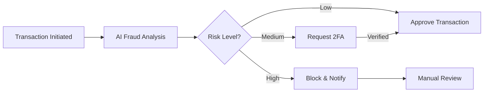

# Usage Guide

This document explains how to use FinovaBank through various interfaces: Web UI, Mobile App, REST API, and CLI tools.

## Table of Contents

- [Web Application Usage](#web-application-usage)
- [Mobile Application Usage](#mobile-application-usage)
- [REST API Usage](#rest-api-usage)
- [CLI Usage](#cli-usage)
- [Common Workflows](#common-workflows)

## Web Application Usage

Access the web application at `http://localhost:3000` after starting the services.

### User Registration

1. Navigate to http://localhost:3000/register
2. Fill in the registration form:
   - Username
   - Email
   - Password (minimum 8 characters)
   - First Name
   - Last Name
3. Click "Register"
4. You'll be redirected to the login page

### User Login

```
URL: http://localhost:3000/login
Credentials: Use your registered username/email and password
```

### Dashboard Overview

After login, you'll see the main dashboard with:

- **Account Summary**: View all your accounts and balances
- **Recent Transactions**: Last 10 transactions
- **Quick Actions**: Create account, transfer money, pay bills
- **Financial Insights**: AI-powered spending analysis
- **Savings Goals**: Track your savings progress

### Account Management

#### Create New Account

```
Path: Dashboard → Accounts → Create Account
Options:
  - Checking Account
  - Savings Account
  - Investment Account
```

Example workflow:

1. Click "Create Account" button
2. Select account type
3. Set initial deposit amount
4. Review and confirm
5. Account is created instantly

#### View Account Details

```
Path: Dashboard → Account List → Click Account
Shows:
  - Account number
  - Balance
  - Transaction history
  - Account statements
```

### Transaction Operations

#### Transfer Money

```javascript
// Web UI Flow
1. Click "Transfer" button
2. Select source account
3. Enter destination account number
4. Enter amount
5. Add description (optional)
6. Review and confirm

// Example
Source: Checking Account (****1234)
Destination: Savings Account (****5678)
Amount: $500.00
Description: Monthly savings
```

#### Bill Payment

```
Path: Dashboard → Payments → Pay Bills
Steps:
  1. Select biller or add new
  2. Enter amount
  3. Choose payment date
  4. Confirm payment
```

### Loans

#### Apply for Loan

```
Path: Dashboard → Loans → Apply
Loan Types:
  - Personal Loan
  - Auto Loan
  - Home Equity Loan

Required Information:
  - Loan amount
  - Loan purpose
  - Employment details
  - Income information
```

Example personal loan application:

```
Amount: $10,000
Purpose: Debt consolidation
Term: 36 months
Employment: Full-time
Annual Income: $60,000
```

#### Track Loan Status

```
Path: Dashboard → Loans → My Loans
View:
  - Application status
  - Approved loans
  - Payment schedule
  - Outstanding balance
```

### Savings Goals

#### Create Savings Goal

```typescript
// Example savings goal
Goal Name: "Vacation Fund"
Target Amount: $5,000
Target Date: December 2025
Monthly Contribution: $200
Linked Account: Savings Account (****5678)
```

Steps:

1. Navigate to Savings Goals
2. Click "Create New Goal"
3. Fill in goal details
4. Set up automatic transfers (optional)
5. Track progress on dashboard

### AI-Powered Features

#### Financial Insights

```
Path: Dashboard → Insights
Features:
  - Spending analysis by category
  - Budget recommendations
  - Unusual transaction alerts
  - Savings opportunities
```

#### Fraud Alerts

The system automatically monitors for:

- Unusual transaction patterns
- High-value transactions
- Foreign transactions
- Multiple failed login attempts

Alerts appear in the notification panel.

## Mobile Application Usage

### Setup Mobile App (React Native)

For development:

```bash
# iOS
cd mobile-frontend
npm install
npx pod-install
npm run ios

# Android
cd mobile-frontend
npm install
npm run android
```

### Mobile App Features

| Feature            | Location            | Description                  |
| ------------------ | ------------------- | ---------------------------- |
| Account Overview   | Home Tab            | View all accounts            |
| Quick Transfer     | Home → Transfer     | Fast money transfer          |
| Mobile Deposit     | Deposit Tab         | Check deposit via camera     |
| ATM Locator        | More → ATM          | Find nearby ATMs             |
| Touch ID/Face ID   | Settings → Security | Biometric authentication     |
| Push Notifications | Automatic           | Real-time transaction alerts |

### Mobile-Specific Features

#### Mobile Check Deposit

```typescript
// Workflow
1. Tap "Deposit Check"
2. Endorse check
3. Take photo of front
4. Take photo of back
5. Enter amount
6. Submit for processing
```

#### Biometric Authentication

```bash
# Enable in app
Settings → Security → Biometric Login → Enable
Options:
  - Touch ID (iOS)
  - Face ID (iOS)
  - Fingerprint (Android)
```

## REST API Usage

### Authentication

All API requests (except login/register) require authentication using JWT tokens.

#### Register User

```bash
curl -X POST http://localhost:8002/api/auth/register \
  -H "Content-Type: application/json" \
  -d '{
    "username": "johndoe",
    "email": "john@example.com",
    "password": "SecurePass123!",
    "firstName": "John",
    "lastName": "Doe"
  }'
```

Response:

```json
{
  "id": "user-uuid",
  "username": "johndoe",
  "email": "john@example.com",
  "message": "User registered successfully"
}
```

#### Login

```bash
curl -X POST http://localhost:8002/api/auth/login \
  -H "Content-Type: application/json" \
  -d '{
    "username": "johndoe",
    "password": "SecurePass123!"
  }'
```

Response:

```json
{
  "accessToken": "eyJhbGciOiJIUzI1NiIsInR5cCI6IkpXVCJ9...",
  "refreshToken": "eyJhbGciOiJIUzI1NiIsInR5cCI6IkpXVCJ9...",
  "tokenType": "Bearer",
  "expiresIn": 3600
}
```

Save the `accessToken` for subsequent requests.

### Account Operations

#### Create Account

```bash
TOKEN="your-access-token"

curl -X POST http://localhost:8002/api/accounts \
  -H "Authorization: Bearer $TOKEN" \
  -H "Content-Type: application/json" \
  -d '{
    "accountType": "CHECKING",
    "initialBalance": 1000.00,
    "currency": "USD"
  }'
```

#### Get Account Balance

```bash
curl -X GET http://localhost:8002/api/accounts/{accountId}/balance \
  -H "Authorization: Bearer $TOKEN"
```

#### List All Accounts

```bash
curl -X GET http://localhost:8002/api/accounts \
  -H "Authorization: Bearer $TOKEN"
```

### Transaction Operations

#### Create Transaction

```bash
curl -X POST http://localhost:8002/api/transactions \
  -H "Authorization: Bearer $TOKEN" \
  -H "Content-Type: application/json" \
  -d '{
    "sourceAccountId": "account-uuid-1",
    "destinationAccountId": "account-uuid-2",
    "amount": 500.00,
    "currency": "USD",
    "type": "TRANSFER",
    "description": "Monthly rent payment"
  }'
```

#### Get Transaction History

```bash
# All transactions
curl -X GET http://localhost:8002/api/transactions \
  -H "Authorization: Bearer $TOKEN"

# Filtered by date
curl -X GET "http://localhost:8002/api/transactions?startDate=2025-01-01&endDate=2025-12-31" \
  -H "Authorization: Bearer $TOKEN"

# By account
curl -X GET "http://localhost:8002/api/transactions?accountId=account-uuid" \
  -H "Authorization: Bearer $TOKEN"
```

### AI Service API

#### Fraud Detection

```bash
curl -X POST http://localhost:8002/api/ai/fraud/analyze \
  -H "Authorization: Bearer $TOKEN" \
  -H "Content-Type: application/json" \
  -d '{
    "transaction_id": "txn-12345",
    "amount": 5000.00,
    "transaction_type": "WITHDRAWAL",
    "timestamp": "2025-12-30T20:00:00Z",
    "account_created_date": "2020-01-01T00:00:00Z",
    "channel": "ONLINE",
    "country": "US",
    "home_country": "US",
    "daily_transaction_count": 3,
    "daily_transaction_amount": 6000.00
  }'
```

Response:

```json
{
  "transaction_id": "txn-12345",
  "risk_score": 0.425,
  "risk_level": "MEDIUM",
  "recommended_action": "REVIEW",
  "fraud_indicators": [
    "High transaction amount",
    "Transaction during unusual hours"
  ],
  "features_analyzed": 12,
  "analysis_timestamp": "2025-12-30T20:05:00Z",
  "model_version": "1.0.0"
}
```

#### Financial Recommendations

```bash
curl -X POST http://localhost:8002/api/ai/recommendations/products \
  -H "Authorization: Bearer $TOKEN" \
  -H "Content-Type: application/json" \
  -d '{
    "customer_id": "user-uuid",
    "age": 30,
    "annual_income": 75000,
    "current_savings": 10000,
    "monthly_expenses": 3500,
    "total_debt": 15000,
    "credit_score": 720,
    "financial_goals": ["home_purchase", "retirement"],
    "current_products": ["checking_account"]
  }'
```

#### Spending Insights

```bash
curl -X POST http://localhost:8002/api/ai/recommendations/spending-insights \
  -H "Authorization: Bearer $TOKEN" \
  -H "Content-Type: application/json" \
  -d '{
    "customer_id": "user-uuid",
    "transaction_history": [
      {"category": "groceries", "amount": 150, "date": "2025-12-01T10:00:00Z"},
      {"category": "dining", "amount": 80, "date": "2025-12-05T19:00:00Z"},
      {"category": "utilities", "amount": 200, "date": "2025-12-10T14:00:00Z"}
    ]
  }'
```

## CLI Usage

FinovaBank provides CLI tools for service management and operations.

### Main CLI Tool: finovabank.sh

```bash
# Show help
./scripts/finovabank.sh --help

# Setup and initialize
./scripts/finovabank.sh setup

# Start all services
./scripts/finovabank.sh start

# Stop all services
./scripts/finovabank.sh stop

# Restart services
./scripts/finovabank.sh restart

# Check service status
./scripts/finovabank.sh status

# View logs
./scripts/finovabank.sh logs [service-name]

# Run tests
./scripts/finovabank.sh test
```

### Database Management CLI

```bash
# Initialize databases
./scripts/finovabank_db.sh init

# Run migrations
./scripts/finovabank_db.sh migrate

# Backup databases
./scripts/finovabank_db.sh backup

# Restore from backup
./scripts/finovabank_db.sh restore backup-file.sql

# Seed test data
./scripts/finovabank_db.sh seed
```

### Deployment CLI

```bash
# Deploy to Kubernetes
./scripts/kubernetes-auto-deploy.sh

# Check deployment status
./scripts/kubernetes-auto-deploy.sh status

# Rollback deployment
./scripts/kubernetes-auto-deploy.sh rollback

# Scale services
./scripts/manage-services.sh scale api-gateway 3
```

### Service Management

```bash
# Start specific service
./scripts/manage-services.sh start auth-service

# Stop specific service
./scripts/manage-services.sh stop auth-service

# Restart service
./scripts/manage-services.sh restart api-gateway

# View service logs
./scripts/manage-services.sh logs transaction-service

# Check service health
./scripts/manage-services.sh health
```

## Common Workflows

### Workflow 1: New Customer Onboarding

```bash
# Step 1: Register user via API
curl -X POST http://localhost:8002/api/auth/register \
  -H "Content-Type: application/json" \
  -d '{"username":"newuser","email":"new@example.com","password":"Pass123!","firstName":"New","lastName":"User"}'

# Step 2: Login and get token
TOKEN=$(curl -X POST http://localhost:8002/api/auth/login \
  -H "Content-Type: application/json" \
  -d '{"username":"newuser","password":"Pass123!"}' \
  | jq -r '.accessToken')

# Step 3: Create checking account
curl -X POST http://localhost:8002/api/accounts \
  -H "Authorization: Bearer $TOKEN" \
  -H "Content-Type: application/json" \
  -d '{"accountType":"CHECKING","initialBalance":100.00,"currency":"USD"}'

# Step 4: Create savings account
curl -X POST http://localhost:8002/api/accounts \
  -H "Authorization: Bearer $TOKEN" \
  -H "Content-Type: application/json" \
  -d '{"accountType":"SAVINGS","initialBalance":500.00,"currency":"USD"}'
```

### Workflow 2: Monthly Bill Payment Automation

Web UI steps:

1. Navigate to Payments → Recurring Payments
2. Add new recurring payment
3. Configure: Biller, Amount, Frequency, Start Date
4. Enable automatic payment
5. System processes payment monthly automatically

### Workflow 3: Loan Application Process

```
1. User: Submit loan application (Web UI or API)
2. System: Perform credit check
3. AI Service: Assess risk score
4. System: Auto-approve or flag for manual review
5. User: Accept loan terms
6. System: Disburse funds to account
7. System: Setup automatic payment schedule
```

### Workflow 4: Fraud Detection Pipeline



### Workflow 5: Savings Goal Achievement

1. Create savings goal with target amount and date
2. Link to savings account
3. Set up automatic monthly transfers
4. System tracks progress
5. AI provides optimization recommendations
6. Receive notifications on milestones
7. Goal completion notification

## API Client Libraries

### JavaScript/TypeScript

```typescript
import axios from "axios";

const API_BASE = "http://localhost:8002";

class FinovaBankClient {
  private token: string = "";

  async login(username: string, password: string) {
    const response = await axios.post(`${API_BASE}/api/auth/login`, {
      username,
      password,
    });
    this.token = response.data.accessToken;
    return response.data;
  }

  async getAccounts() {
    return axios.get(`${API_BASE}/api/accounts`, {
      headers: { Authorization: `Bearer ${this.token}` },
    });
  }

  async createTransaction(data: any) {
    return axios.post(`${API_BASE}/api/transactions`, data, {
      headers: { Authorization: `Bearer ${this.token}` },
    });
  }
}
```

### Python

```python
import requests

class FinovaBankClient:
    def __init__(self, base_url='http://localhost:8002'):
        self.base_url = base_url
        self.token = None

    def login(self, username, password):
        response = requests.post(
            f'{self.base_url}/api/auth/login',
            json={'username': username, 'password': password}
        )
        response.raise_for_status()
        data = response.json()
        self.token = data['accessToken']
        return data

    def get_accounts(self):
        response = requests.get(
            f'{self.base_url}/api/accounts',
            headers={'Authorization': f'Bearer {self.token}'}
        )
        response.raise_for_status()
        return response.json()
```

## Next Steps

- Explore [API.md](API.md) for complete API reference
- Check [EXAMPLES/](examples/) for more code examples
- Read [CONFIGURATION.md](CONFIGURATION.md) for advanced configuration
- Review [TROUBLESHOOTING.md](TROUBLESHOOTING.md) for common issues
