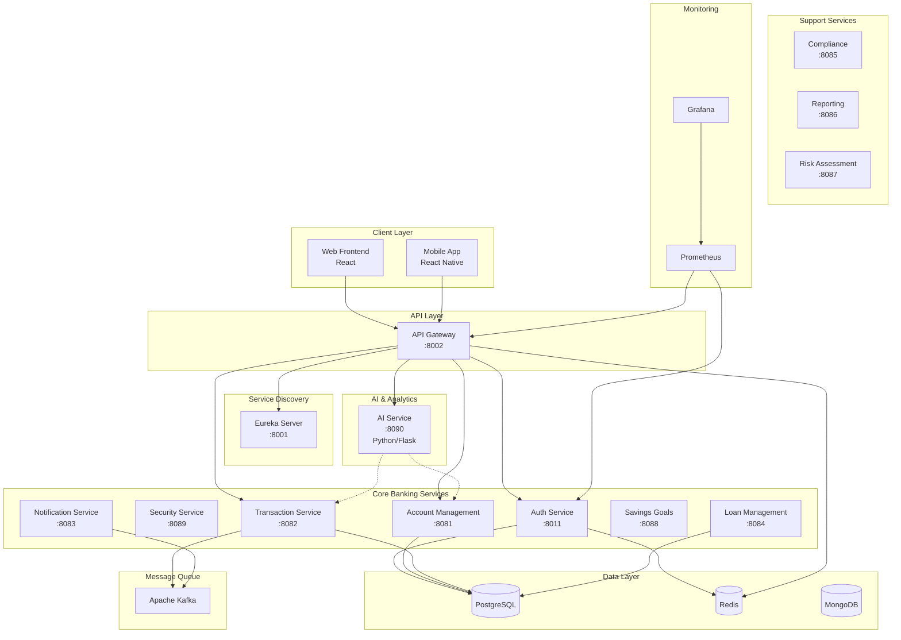
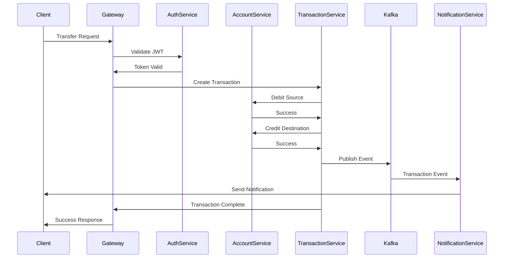
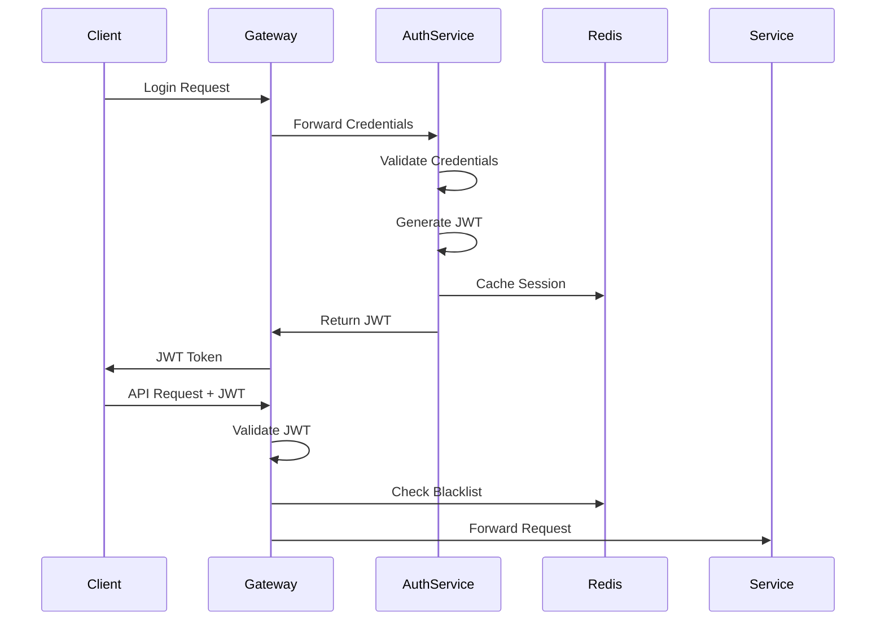

# Architecture Documentation

System architecture and design overview for FinovaBank.

## Table of Contents

- [High-Level Architecture](#high-level-architecture)
- [Microservices Architecture](#microservices-architecture)
- [Service Communication](#service-communication)
- [Data Architecture](#data-architecture)
- [Deployment Architecture](#deployment-architecture)
- [Technology Stack](#technology-stack)

## High-Level Architecture



## Microservices Architecture

### Service Overview

| Service              | Port | Technology           | Database      | Purpose                      |
| -------------------- | ---- | -------------------- | ------------- | ---------------------------- |
| Eureka Server        | 8001 | Spring Boot          | N/A           | Service discovery            |
| API Gateway          | 8002 | Spring Cloud Gateway | Redis (cache) | Routing, auth, rate limiting |
| Auth Service         | 8011 | Spring Boot          | PostgreSQL    | User authentication          |
| Security Service     | 8089 | Spring Boot          | PostgreSQL    | Security policies            |
| Account Management   | 8081 | Spring Boot          | PostgreSQL    | Account CRUD                 |
| Transaction Service  | 8082 | Spring Boot          | PostgreSQL    | Transaction processing       |
| Notification Service | 8083 | Spring Boot          | PostgreSQL    | Alerts and notifications     |
| Loan Management      | 8084 | Spring Boot          | PostgreSQL    | Loan lifecycle               |
| Compliance Service   | 8085 | Spring Boot          | PostgreSQL    | Regulatory compliance        |
| Reporting            | 8086 | Spring Boot          | PostgreSQL    | Report generation            |
| Risk Assessment      | 8087 | Spring Boot          | PostgreSQL    | Risk analysis                |
| Savings Goals        | 8088 | Spring Boot          | PostgreSQL    | Goal tracking                |
| AI Service           | 8090 | Python/Flask         | SQLite        | ML models                    |
| Web Frontend         | 3000 | React/TypeScript     | N/A           | User interface               |
| Mobile Frontend      | -    | React Native         | N/A           | Mobile UI                    |

### Service Dependencies

```
Eureka Server (no dependencies)
  ↓
API Gateway → Eureka
  ↓
All Services → Eureka, API Gateway
```

### Module Mapping

| Module              | Source Files                   | Key Classes                                                  |
| ------------------- | ------------------------------ | ------------------------------------------------------------ |
| Eureka Server       | `backend/eureka-server/`       | `EurekaServerApplication.java`                               |
| API Gateway         | `backend/api-gateway/`         | `ApiGatewayApplication.java`, `JwtAuthenticationFilter.java` |
| Auth Service        | `backend/auth-service/`        | `AuthController.java`, `JwtTokenProvider.java`               |
| Account Management  | `backend/account-management/`  | `AccountController.java`, `AccountServiceImpl.java`          |
| Transaction Service | `backend/transaction-service/` | `TransactionController.java`, `TransactionServiceImpl.java`  |
| AI Service          | `backend/ai-service/src/`      | `main.py`, `fraud_detection.py`, `recommendations.py`        |
| Web Frontend        | `web-frontend/src/`            | `Dashboard.tsx`, `Login.tsx`, `AccountDetails.tsx`           |

## Service Communication

### Synchronous Communication

Services communicate via REST APIs through the API Gateway:

```
Client → API Gateway → Service Discovery (Eureka) → Target Service
```

**Example Flow:**

1. Client sends request to API Gateway (e.g., `POST /api/auth/login`)
2. Gateway validates JWT (if required)
3. Gateway queries Eureka for service instances
4. Gateway load-balances request to available instance
5. Service processes request
6. Response flows back through Gateway to Client

### Asynchronous Communication

Event-driven communication via Kafka:

**Topics:**

- `transaction-events` - Transaction notifications
- `account-events` - Account changes
- `notification-events` - User notifications
- `fraud-alerts` - Security alerts

**Example:**

```java
// Publisher (Transaction Service)
kafkaTemplate.send("transaction-events", transactionEvent);

// Consumer (Notification Service)
@KafkaListener(topics = "transaction-events")
public void handleTransaction(TransactionEvent event) {
    sendNotification(event);
}
```

## Data Architecture

### Database Schema Design

Each microservice has its own database (database-per-service pattern):

**Auth Service Database:**

```sql
users (id, username, email, password_hash, created_at)
roles (id, name)
user_roles (user_id, role_id)
```

**Account Management Database:**

```sql
accounts (id, user_id, account_number, type, balance, currency, status)
account_history (id, account_id, balance, timestamp)
```

**Transaction Service Database:**

```sql
transactions (id, source_account_id, dest_account_id, amount, type, status, created_at)
```

### Data Flow



### Caching Strategy

**Redis Cache:**

- JWT tokens (blacklist for logout)
- Session data
- Frequently accessed account balances
- User profiles
- API rate limiting counters

**Cache TTL:**

- User sessions: 1 hour
- Account balances: 5 minutes
- User profiles: 30 minutes
- Rate limit counters: 1 minute

## Deployment Architecture

### Docker Compose (Development)

```yaml
Services:
  - eureka-server (1 instance)
  - api-gateway (1 instance)
  - All backend services (1 instance each)
  - web-frontend (1 instance)
  - prometheus (1 instance)
  - grafana (1 instance)

Networks:
  - finova-network (bridge)

Volumes:
  - grafana-storage (persistent)
```

### Kubernetes (Production)

```
Namespace: finovabank

Deployments:
  - Each service: 2-3 replicas
  - Auto-scaling enabled
  - Resource limits enforced

Services:
  - ClusterIP for internal services
  - LoadBalancer for API Gateway
  - NodePort for monitoring

Ingress:
  - NGINX Ingress Controller
  - TLS termination
  - Path-based routing

ConfigMaps:
  - Application configuration
  - Environment variables

Secrets:
  - Database credentials
  - JWT secrets
  - API keys
```

### Cloud Architecture (AWS)

```
Region: us-east-1

Compute:
  - EKS Cluster (managed Kubernetes)
  - EC2 instances (worker nodes)
  - Auto Scaling Groups

Database:
  - RDS PostgreSQL (Multi-AZ)
  - ElastiCache Redis
  - DocumentDB (MongoDB compatible)

Storage:
  - S3 (backups, logs)
  - EBS (persistent volumes)

Networking:
  - VPC with public/private subnets
  - Application Load Balancer
  - Route53 (DNS)

Security:
  - IAM roles and policies
  - Security Groups
  - AWS WAF
```

## Technology Stack

### Backend

| Component         | Technology           | Version  | Purpose                      |
| ----------------- | -------------------- | -------- | ---------------------------- |
| Language          | Java                 | 17       | Main application language    |
| Framework         | Spring Boot          | 2.7.14   | Microservices framework      |
| Cloud             | Spring Cloud         | 2021.0.8 | Microservices patterns       |
| Service Discovery | Netflix Eureka       | -        | Service registry             |
| API Gateway       | Spring Cloud Gateway | -        | Routing and filtering        |
| Security          | Spring Security      | -        | Authentication/authorization |
| Data Access       | Spring Data JPA      | -        | Database ORM                 |
| Database          | PostgreSQL           | 42.6.0   | Primary database             |
| Cache             | Redis                | -        | Distributed cache            |
| Messaging         | Apache Kafka         | 3.5.1    | Event streaming              |
| Validation        | Hibernate Validator  | -        | Input validation             |
| Documentation     | Springdoc OpenAPI    | 1.7.0    | API documentation            |
| Build Tool        | Maven                | 3.6+     | Dependency management        |

### AI/ML

| Component       | Technology   | Version |
| --------------- | ------------ | ------- |
| Language        | Python       | 3.8+    |
| Web Framework   | Flask        | 3.1.1   |
| ML Library      | scikit-learn | 1.7.1   |
| Data Processing | pandas       | 2.3.2   |
| Numerical       | numpy        | 2.3.2   |
| Database        | SQLAlchemy   | 2.0.41  |

### Frontend

| Component        | Technology       | Version |
| ---------------- | ---------------- | ------- |
| Web Framework    | React            | 18.3.1  |
| Language         | TypeScript       | 4.9.5   |
| UI Library       | Material-UI      | 5.15.21 |
| State Management | Redux Toolkit    | -       |
| Routing          | React Router     | 6.24.1  |
| Forms            | Formik           | 2.4.6   |
| Validation       | Yup              | 1.4.0   |
| Charts           | Chart.js         | 4.4.3   |
| HTTP Client      | Axios            | 1.7.2   |
| Mobile           | React Native     | 0.72.17 |
| Navigation       | React Navigation | 7.1.6   |

### DevOps

| Component         | Technology     | Purpose                     |
| ----------------- | -------------- | --------------------------- |
| Containerization  | Docker         | Container runtime           |
| Orchestration     | Kubernetes     | Container orchestration     |
| CI/CD             | GitHub Actions | Automation pipeline         |
| IaC               | Terraform      | Infrastructure provisioning |
| Config Management | Ansible        | Server configuration        |
| Monitoring        | Prometheus     | Metrics collection          |
| Visualization     | Grafana        | Metrics dashboards          |
| Logging           | ELK Stack      | Log aggregation             |
| Registry          | Docker Hub     | Container images            |

## Design Patterns

### Microservices Patterns

1. **Service Discovery** - Eureka for dynamic service registration
2. **API Gateway** - Single entry point for all clients
3. **Circuit Breaker** - Resilience4j for fault tolerance
4. **Database per Service** - Each service owns its data
5. **Event-Driven** - Kafka for async communication
6. **CQRS** - Separate read/write models where needed
7. **Saga** - Distributed transactions

### Code Patterns

- **Repository Pattern** - Data access abstraction
- **Service Layer** - Business logic separation
- **DTO Pattern** - Data transfer objects
- **Builder Pattern** - Object construction
- **Factory Pattern** - Object creation
- **Strategy Pattern** - Algorithm selection
- **Observer Pattern** - Event notification

## Security Architecture

### Authentication Flow



### Security Layers

1. **Network Layer** - VPC, Security Groups, WAF
2. **Transport Layer** - TLS 1.3 encryption
3. **API Layer** - JWT authentication, rate limiting
4. **Service Layer** - Authorization, input validation
5. **Data Layer** - Encryption at rest, field-level encryption

## Performance Considerations

### Scalability

- **Horizontal Scaling** - Add more service instances
- **Vertical Scaling** - Increase instance resources
- **Database Scaling** - Read replicas, sharding
- **Caching** - Redis for frequently accessed data
- **CDN** - Static assets delivery

### Optimization

- **Connection Pooling** - HikariCP (20 max connections)
- **Lazy Loading** - JPA fetch strategies
- **Async Processing** - Kafka for non-blocking operations
- **Pagination** - Limit query results
- **Indexing** - Database query optimization

## Monitoring and Observability

### Metrics

- **Application Metrics** - Micrometer + Prometheus
- **Business Metrics** - Transaction volume, user activity
- **Infrastructure Metrics** - CPU, memory, disk, network

### Logging

- **Structured Logging** - JSON format
- **Log Levels** - DEBUG, INFO, WARN, ERROR
- **Centralized Logging** - ELK Stack
- **Log Correlation** - Trace IDs across services

### Tracing

- **Distributed Tracing** - Spring Cloud Sleuth
- **Trace Propagation** - HTTP headers
- **Span Collection** - Zipkin (planned)

## See Also

- [INSTALLATION.md](INSTALLATION.md) - Setup instructions
- [CONFIGURATION.md](CONFIGURATION.md) - Configuration guide
- [FEATURE_MATRIX.md](FEATURE_MATRIX.md) - Feature overview
- [API.md](API.md) - API reference
